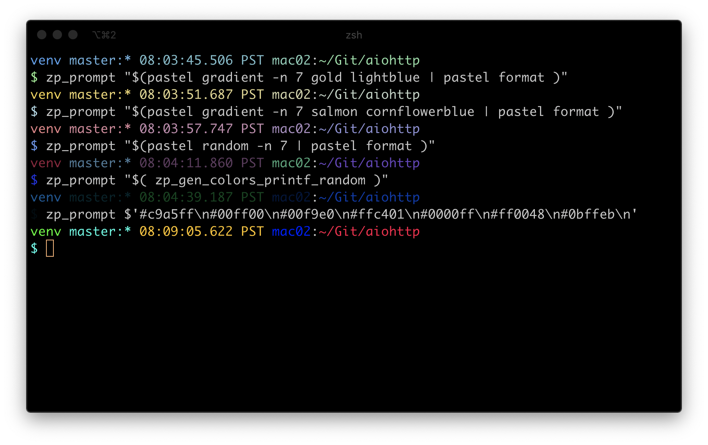
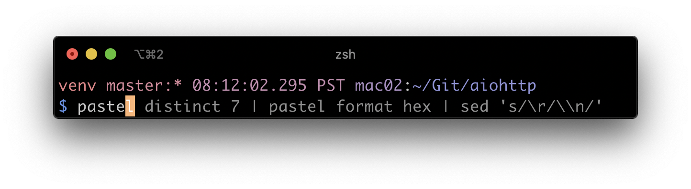
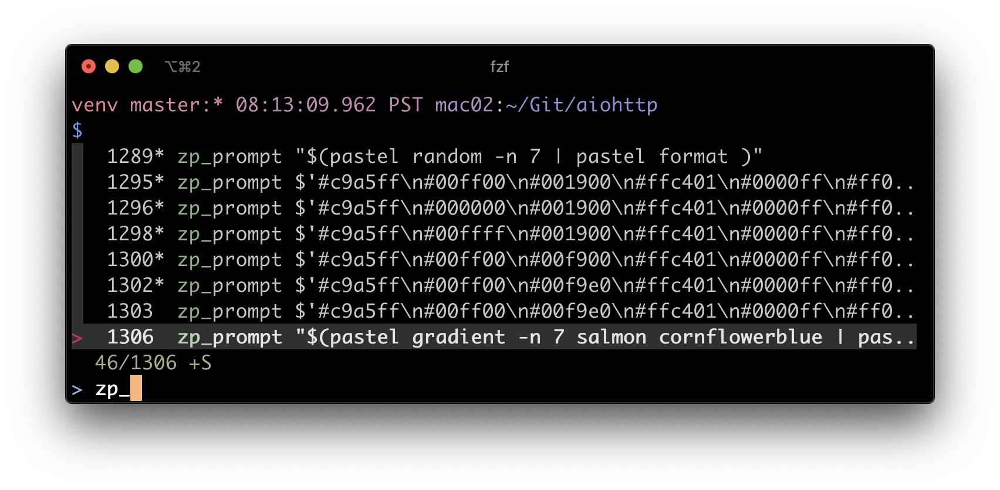
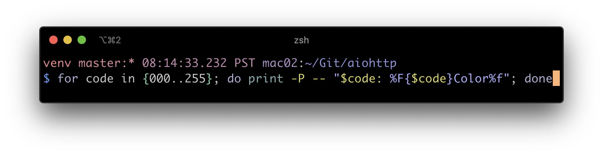
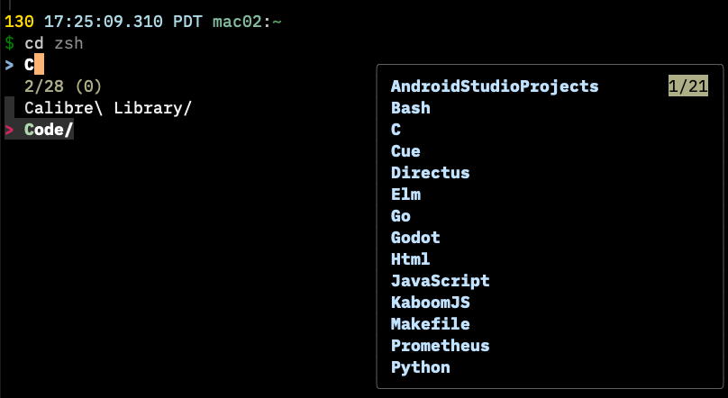
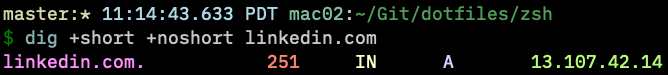

# Ben's Zsh Customizations and Plugins!!!

## Design Goals

- Don't change how the shell works too much! I `ssh` into other machines installed with `bash`, and it's essential that I don't need to context switch too hard when I do. This config tries to accomplish this by:
  - using `zsh` (fairly `bash` compatible)
  - focusing on making common shell operations easier and faster, not replacing them wholesale. Think "turn the shell prompt into an IDE" - code should be faster to write, but it should look the same as if you didn't have the IDE
- Make my customizations easy to install, easy to play with, and easy to uninstall. This should be easy to "try out". This config tries to accomplish this by:
  - not replacing `~/.zshrc` but instead providing `source <file>` lines to add to it - this lets users keep their own configuration and toggling mine on and off by commenting a line or two
  - putting different functionality in different files to source. Want only one of `zp_prompt` and `zshrc_common`? `source` one but not the other
  - adding `curl` install commands (I actually use `fling` to provide these files so I can easily keep them in Git)
  - noting keyboard shortcuts the tools add I really like in this README and adding screenshots

## Install via [fling](https://github.com/bbkane/fling/)

NOTE: this is not necessary if you use the `curl` commands provided and most people should use those. I use the `fling` method below to keep all my `zsh` config under version control, and you probably don't care about that

Clone the repo and `fling`. Most people should use the `curl` install methods instead.

## Install [Common Settings](./.zshrc_common.zsh)

Common functions and settings.

### Install via Curl

```bash
curl -Lo ~/.zshrc_common.zsh https://raw.githubusercontent.com/bbkane/dotfiles/master/zsh/.zshrc_common.zsh
```

```bash
cat >> "$HOME/.zshrc" << 'EOF'

# See https://github.com/bbkane/dotfiles
source ~/.zshrc_common.zsh

EOF
```

Open a new `zsh` shell.

## Install [`zp_prompt`](./dot-zshrc_prompt.zsh)

Change prompt colors on the fly!



### Install via Curl

```
curl -Lo ~/.zshrc_prompt.zsh https://raw.githubusercontent.com/bbkane/dotfiles/master/zsh/.zshrc_prompt.zsh
```

```
brew install pastel  # Optional but highly recommended
```

```
cat >> "$HOME/.zshrc" << 'EOF'
# See https://github.com/bbkane/dotfiles
source ~/.zshrc_prompt.zsh
zp_prompt_pastel dodgerblue lightgreen

EOF
```

Open a new `zsh` shell.

## Install [zsh-autosuggestions](https://github.com/zsh-users/zsh-autosuggestions)

Add auto-complete based on history. Accept suggestions with `<Ctrl><Space>` or right arrow key.



```
brew install zsh-autosuggestions
```

```
cat >> "$HOME/.zshrc" << 'EOF'
# NOTE: this source location might change if brew changes how it installs
# See `brew info zsh-autosuggestions`
source /usr/local/share/zsh-autosuggestions/zsh-autosuggestions.zsh
bindkey '^ ' autosuggest-accept  # also use Ctrl+Space to accept

EOF
```

Open a new `zsh` shell.

## Install [fzf](https://github.com/junegunn/fzf)

- Search through shell history interactively (`<Ctrl>r`)
- Search through file names (`<Ctrl>t`). Example: `cat <Ctrl>t`
- Search through file names (`**<Tab>`). Example `cat ./project/**<Tab>`
- Adds autocomplete with `<Tab>` to `kill`
- SSH with completion from `/etc/hosts` and `~/.ssh/config` with `ssh **<Tab>`
- `unset`, `export`, and `unalias` with completion with `unset **<Tab>`



```
brew install fzf
```

Run the install script it prints on install (`/usr/local/opt/fzf/install` for me).

This modifies `~/.zshrc` for you

## ~~Install [fasd](https://github.com/clvv/fasd)~~

> NOTE: fasd has been deprecated by Homebrew. It's probably better at this point to use `zoxide`. See the next section. I have ported and undeprecated the formula to my personal homebrew tap, just in case `zoxide` doesn't keep me happy: `brew install bbkane/tap/fasd`.

`fasd` lets you:

- Open recently/frequently used files with `v <fuzzy-term><Tab>`
- `cd` to recent/frequent directories with `z <fuzzy-term><Tab>`
- Trigger completion with `<Ctrl>x<Ctrl>a` - example `vim <Ctrl>x<Ctrl>a`

```
brew install fasd
```

```
cat >> "$HOME/.zshrc" << 'EOF'
# NOTE: this has to build a database of frecently used files and dirs
# so it won't be useful for a while. Once it has a list, use `z <fuzzyname>`
# to cd into a directory or `v <fuzzyname>` to nvim it. Push <TAB> to complete from list
eval "$(fasd --init auto)"
alias v='f -e nvim' # quick opening files with nvim
bindkey '^X^A' fasd-complete

EOF
```

Open a new `zsh` shell.

## Install [`zoxide`](https://github.com/ajeetdsouza/zoxide)

`zoxide` is a replacement for `fasd`, which has been deprecated in Homebrew :(

It has some differences:

- doesn't support frecently used files with `v`
- **requires** a space after z to trigger fancy autocompletion: `z startofname<SPACE><TAB>` 
- It does let you edit the database.

```bash
brew install zoxide
```

Also see notes about `compinit` in the [README](https://github.com/ajeetdsouza/zoxide).

```bash
echo '
eval "$(zoxide init zsh)"
' >> "$HOME/.zshrc"
```


## Install [`fast-syntax-highlighting`](https://github.com/zdharma/fast-syntax-highlighting)

Add syntax highglighting while typing



I clone into `~/Git`. Change this name if you want to clone somewhere else!

```
git clone https://github.com/zdharma/fast-syntax-highlighting ~/Git-GH/fast-syntax-highlighting
```

```
cat >> "$HOME/.zshrc" << 'EOF'
source ~/Git-GH/fast-syntax-highlighting/F-Sy-H.plugin.zsh

EOF
```

Open a new `zsh` shell.

## Install [fzf-tab](https://github.com/Aloxaf/fzf-tab)

Add fuzzy completion to tab-complete. Very useful when there's a bunch of similarly named things in a directory (like ticket notes).



Clone the repo:

```bash
git clone https://github.com/Aloxaf/fzf-tab ~/Git-GH/fzf-tab
```

Add to zshrc:

```bash
# https://github.com/Aloxaf/fzf-tab
source ~/Git-GH/fzf-tab/fzf-tab.plugin.zsh
# Can run `build-fzf-tab-module` to get some colors ( https://github.com/Aloxaf/fzf-tab#binary-module )
# fzf-tab completions settings - not sure how much I need these :)
# disable sort when completing `git checkout`
zstyle ':completion:*:git-checkout:*' sort false
# set descriptions format to enable group support
zstyle ':completion:*:descriptions' format '[%d]'
# set list-colors to enable filename colorizing
zstyle ':completion:*' list-colors ${(s.:.)LS_COLORS}
# preview directory's content with exa when completing cd
zstyle ':fzf-tab:complete:cd:*' fzf-preview 'exa -1 --color=always $realpath'
# switch group using `,` and `.`
zstyle ':fzf-tab:*' switch-group ',' '.'
```

Install `exa` for directory previews:

```bash
brew install exa
```

Build the `ff-tab-module` to get colors (requires C compliation toolchain):

```bash
build-fzf-tab-module
```

## Install [warhol.plugin.zsh](https://github.com/unixorn/warhol.plugin.zsh)

Colorize command output using grc and lscolors



```bash
brew install grc
```

```bash
git clone https://github.com/unixorn/warhol.plugin.zsh.git  ~/Git-GH/warhol.plugin.zsh
```

```bash
printf '
# https://github.com/unixorn/warhol.plugin.zsh
source ~/Git-GH/warhol.plugin.zsh/warhol.plugin.zsh
' >> ~/.zshrc
```

## Install [zsh-completions](https://github.com/zsh-users/zsh-completions)

This particularly helps with `openssl` completion.

```bash
brew install zsh-completions
```

```bash
printf '
# https://github.com/zsh-users/zsh-completions
if type brew &>/dev/null; then
    FPATH=$(brew --prefix)/share/zsh-completions:$FPATH

    autoload -Uz compinit
    compinit
fi
' >> ~/.zshrc
```

If getting the following error:

```bash
Last login: Fri Jan  6 05:07:16 on ttys002
zsh compinit: insecure directories, run compaudit for list.
Ignore insecure directories and continue [y] or abort compinit [n]? y
05:07:33.237 PST mac02:~
$
05:07:33.261 PST mac02:~
$ compaudit
There are insecure directories:
/usr/local/share
```

Fix it with this [StackOverflow answer](https://stackoverflow.com/a/22753363/2958070):

```bash
chmod g-w /usr/local/share
```

And open a new terminal window

## Notes

see [./README_notes.md](./README_notes.md)

## TODO

- make blog post of zsh/fasd/fzf/zsh-autosuggestions
- prompt: consider indicating username when logged into a remote host
- url auto-complete, tetris: https://matt.blissett.me.uk/linux/zsh/zshrc
- autocomplete: https://unix.stackexchange.com/a/214699/185953
- mess with vim mode? http://zsh.sourceforge.net/Doc/Release/Zsh-Line-Editor.html#Zle-Widgets
- https://github.com/romkatv/powerlevel10k
- Try https://github.com/denisidoro/navi ? Things I'd like a cheatsheet for: curl, az

```
$ gh search issues --author bbkane --state open --owner bbkane --limit 3 --json number,repository,title,updatedAt,url --template '{{range .}}{{tablerow (printf "#%v" .number | color "green") (timeago .updatedAt) .repository.name (hyperlink .url .title)}}{{"\n"}}{{end}}'
```
