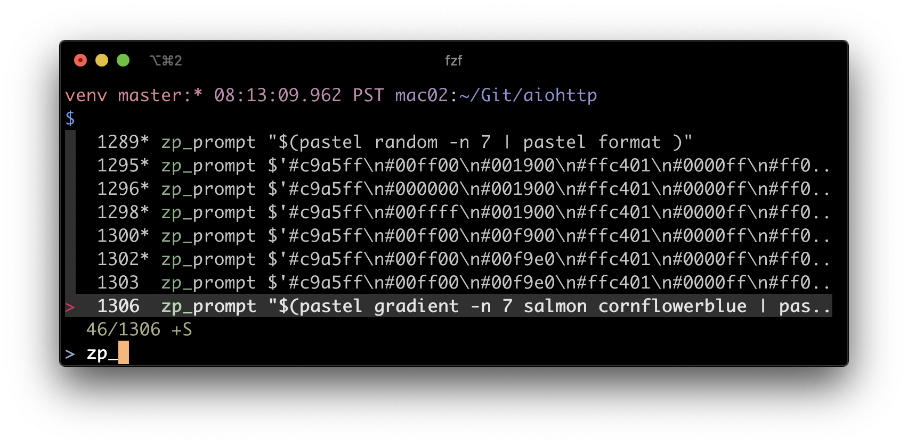
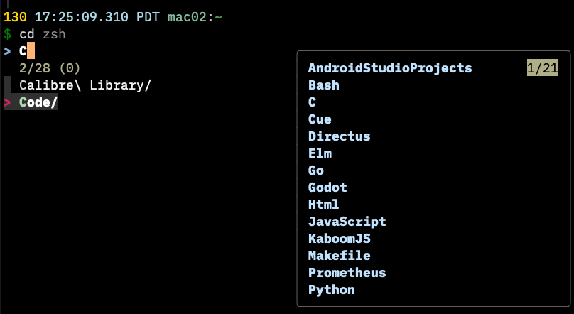
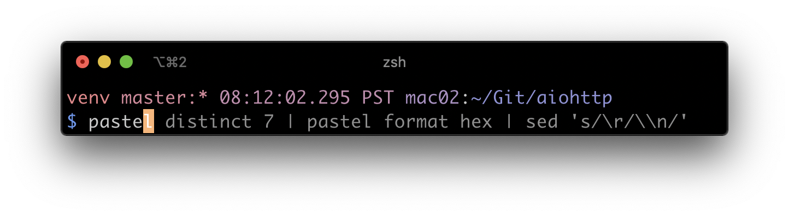
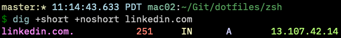
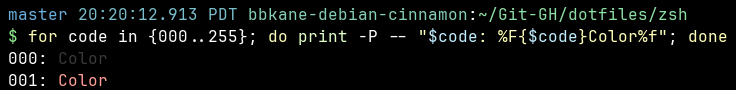
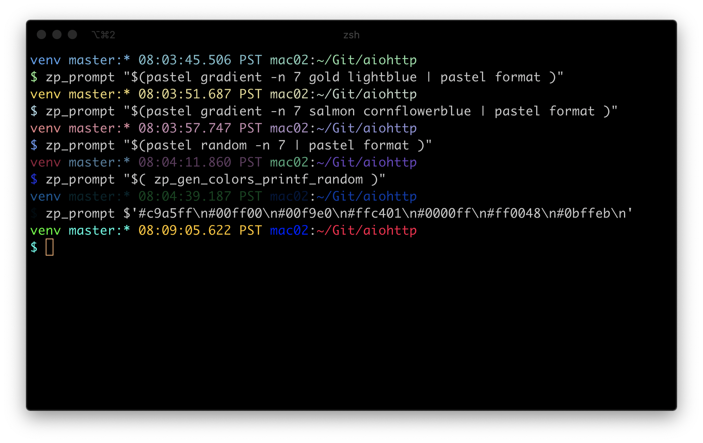

# Ben's Zsh Customizations and Plugins!!!

## Design goals

- Don't change how the shell works too much. I `ssh` into machines that use
  `bash`, so this configuration focuses on making common shell operations
  easier and faster rather than replacing them wholesale.
- Make the customizations easy to install, try, and uninstall.
- Keep the user's `~/.zshrc` small and machine-specific.
- Keep the prompt independently toggleable from the rest of the configuration.
- Keep each plugin's activation and settings together.

## Configuration architecture

The shared configuration is split by responsibility:

| Repository file | Installed path | Responsibility |
| --- | --- | --- |
| [`dot-zshrc_common.zsh`](./dot-zshrc_common.zsh) | `~/.zshrc_common.zsh` | Entry point that declares autoloads and sources the other shared modules in order |
| [`dot-zshrc_core.zsh`](./dot-zshrc_core.zsh) | `~/.zshrc_core.zsh` | Aliases, exports, helper functions, key bindings, history, and shell options |
| [`dot-zshrc_completion.zsh`](./dot-zshrc_completion.zsh) | `~/.zshrc_completion.zsh` | Native zsh completion paths, initialization, caching, and generic completion behavior |
| [`dot-zshrc_plugins.zsh`](./dot-zshrc_plugins.zsh) | `~/.zshrc_plugins.zsh` | Third-party plugin activation and every setting owned by those plugins |
| [`dot-zshrc_prompt.zsh`](./dot-zshrc_prompt.zsh) | `~/.zshrc_prompt.zsh` | Optional prompt implementation |

The common entry point loads `core`, `completion`, `plugins`, and `prompt` in that order.
This ensures completion paths are configured before `compinit`, and plugins
that use completion are loaded afterward.

The configuration assumes all dependencies documented below are installed.
Missing commands or plugin files intentionally produce visible startup errors
instead of silently disabling features.

## Install dependencies

Homebrew sets `$HOMEBREW_PREFIX` through `brew shellenv` in `~/.zprofile`.
The configuration uses that variable instead of calling `brew --prefix`
during shell startup.

```bash
brew install \
    eza \
    fzf \
    grc \
    zoxide \
    zsh-autosuggestions \
    zsh-completions \
    zsh-syntax-highlighting

# Optional, but highly recommended for the prompt.
brew install pastel
```

Clone the plugins that are not installed by Homebrew:

```bash
export GIT_PLUGIN_DIR="$HOME/Git-GH"
git clone https://github.com/Aloxaf/fzf-tab "$GIT_PLUGIN_DIR/fzf-tab"
git clone https://github.com/unixorn/warhol.plugin.zsh.git "$GIT_PLUGIN_DIR/warhol.plugin.zsh"
```

If `compinit` reports insecure directories after installing
`zsh-completions`, see the output of `brew info zsh-completions`.

## Install the configuration files

I install these dotfiles by cloning this repository and using
[`fling`](https://github.com/bbkane/fling/) to create symlinks at the installed
paths shown above.

They can also be downloaded directly:

```bash
base_url=https://raw.githubusercontent.com/bbkane/dotfiles/master/zsh
curl -Lo ~/.zshrc_common.zsh "$base_url/dot-zshrc_common.zsh"
curl -Lo ~/.zshrc_core.zsh "$base_url/dot-zshrc_core.zsh"
curl -Lo ~/.zshrc_completion.zsh "$base_url/dot-zshrc_completion.zsh"
curl -Lo ~/.zshrc_plugins.zsh "$base_url/dot-zshrc_plugins.zsh"
curl -Lo ~/.zshrc_prompt.zsh "$base_url/dot-zshrc_prompt.zsh"
```

The shared modules honor `$ZDOTDIR` when locating one another. Install all five
modules together under `${ZDOTDIR:-$HOME}`, even if you do not enable the prompt.

## Configure `~/.zshrc`

The reusable configuration now requires only one source line. The prompt
remains a separate opt-in:

```zsh
# Machine-specific setup may go above this.

export GIT_PLUGIN_DIR="$HOME/Git-GH"
source "${ZDOTDIR:-$HOME}/.zshrc_common.zsh"
# Optional prompt.
zp_prompt_pastel dodgerblue lightgreen

# Machine-specific setup that must run last may go below this.
```

Open a new `zsh` shell after installing or updating the files.

## Native zsh completion

[`dot-zshrc_completion.zsh`](./dot-zshrc_completion.zsh) adds these directories
to `$FPATH` before calling `compinit`:

```zsh
FPATH="$HOMEBREW_PREFIX/share/zsh-completions:$FPATH"
FPATH="$HOMEBREW_PREFIX/share/zsh/site-functions:$FPATH"
FPATH="$HOME/fbin:$FPATH"
```

`compinit` is by far the slowest part of zsh startup. Most of that cost is its
security audit and rewriting `~/.zcompdump`, so the module performs the full
work only when the dump is more than 24 hours old:

```zsh
if [[ -n ~/.zcompdump(#qN.mh+24) ]]; then
    compinit
else
    compinit -C
fi

bashcompinit
```

The `(#qN.mh+24)` glob qualifier matches the file only when it is older than
24 hours. If no file matches, the `-C` fast path reuses the cached dump.

The same module owns generic native-zsh completion settings:

```zsh
zstyle ':completion:*' list-suffixes
zstyle ':completion:*' expand prefix suffix
zstyle ':completion:*' menu select
zstyle ':completion:*' use-cache on
zstyle ':completion:*' cache-path "${XDG_CACHE_HOME:-$HOME/.cache}/zsh/.zcompcache"
```

Plugin-specific completion settings remain with their plugins below.

## Plugin settings reference

[`dot-zshrc_plugins.zsh`](./dot-zshrc_plugins.zsh) applies all settings in this
section automatically. They are shown here to document the behavior, not as
snippets to copy into `~/.zshrc`.

### [`fzf`](https://github.com/junegunn/fzf)

> Last updated: 2024-04-02

- Search shell history interactively with <kbd>Ctrl</kbd>+<kbd>R</kbd>.
- Search file names with <kbd>Ctrl</kbd>+<kbd>T</kbd>.
- Complete file names with `**`<kbd>Tab</kbd>.
- Complete processes for `kill`.
- Complete SSH hosts from `/etc/hosts` and `~/.ssh/config`.
- Complete values for `unset`, `export`, and `unalias`.



The plugin module enables all zsh integration generated by fzf:

```zsh
eval "$(fzf --zsh)"
```

### [`fzf-tab`](https://github.com/Aloxaf/fzf-tab)

> Last updated: 2024-04-02

Adds fuzzy selection to tab completion.



`fzf-tab` must load after `compinit`, but before plugins that wrap ZLE widgets,
such as `zsh-autosuggestions` and `zsh-syntax-highlighting`. The common
orchestrator enforces that order.

The plugin and all of its settings stay together:

```zsh
source "$HOME/Git-GH/fzf-tab/fzf-tab.plugin.zsh"

# Do not sort branches when completing `git checkout`.
zstyle ':completion:*:git-checkout:*' sort false
# Format descriptions to enable group support.
zstyle ':completion:*:descriptions' format '[%d]'
# Colorize file names.
zstyle ':completion:*' list-colors ${(s.:.)LS_COLORS}
# Let fzf-tab capture the unambiguous prefix.
zstyle ':completion:*' menu no
# Preview directory contents when completing `cd`.
zstyle ':fzf-tab:complete:cd:*' fzf-preview 'eza -1 --color=always $realpath'
# Switch groups with `<` and `>`.
zstyle ':fzf-tab:*' switch-group '<' '>'
```

The upstream README suggests `build-fzf-tab-module` to speed up file
colorization, but that build failed for me and file colorization has not been a
performance problem.

### [`zsh-autosuggestions`](https://github.com/zsh-users/zsh-autosuggestions)

> Last updated: 2024-04-02

Suggests completions based on history. Accept a suggestion with the right arrow
or <kbd>Ctrl</kbd>+<kbd>Space</kbd>.



The plugin module owns the source path, additional binding, and highlight
color:

```zsh
source "$HOMEBREW_PREFIX/share/zsh-autosuggestions/zsh-autosuggestions.zsh"
bindkey '^ ' autosuggest-accept
export ZSH_AUTOSUGGEST_HIGHLIGHT_STYLE='fg=#737373'
```

### [`zoxide`](https://github.com/ajeetdsouza/zoxide)

> Last updated: 2024-04-02

`zoxide` replaces the deprecated `fasd`.

- Use `zi` to choose a frequently used directory with fzf.
- Use `z startofname `<kbd>Tab</kbd> to complete a directory. The space before
  <kbd>Tab</kbd> is required.
- Edit the frecency database with zoxide's commands.

The plugin module initializes its zsh integration:

```zsh
eval "$(zoxide init zsh)"
```

Also see the upstream
[`compinit` notes](https://github.com/ajeetdsouza/zoxide).

### [warhol.plugin.zsh](https://github.com/unixorn/warhol.plugin.zsh)

> Last updated: 2024-04-02

Colorizes command output using `grc` and `lscolors`.



Warhol does not color the configured `ls` alias reliably, so the plugin module
keeps both the exception and plugin activation together:

```zsh
export warhol_ignore_ls=1
source "$HOME/Git-GH/warhol.plugin.zsh/warhol.plugin.zsh"
```

### [`zsh-syntax-highlighting`](https://github.com/zsh-users/zsh-syntax-highlighting)

> Last updated: 2025-08-26

Adds syntax highlighting while typing:



The plugin module enables the `main` and `brackets` highlighters, then sources
the plugin:

```zsh
ZSH_HIGHLIGHT_HIGHLIGHTERS=(main brackets)
source "$HOMEBREW_PREFIX/share/zsh-syntax-highlighting/zsh-syntax-highlighting.zsh"
```

This is deliberately the last plugin loaded because it wraps ZLE widgets.

## Prompt

[`dot-zshrc_prompt.zsh`](./dot-zshrc_prompt.zsh) is loaded by the common
configuration, but sourcing it only defines functions. The first call to
`zp_prompt` (including through `zp_prompt_pastel`) registers the prompt hooks,
enables `prompt_subst`, and disables virtualenv's built-in prompt formatting.
Initialization runs once per shell; changing colors does not repeat it.
Without either call, the prompt hooks and global settings remain untouched.



It provides:

- customizable colors
- Python virtual environment and Git status
- non-zero return codes
- a subsecond timestamp and timezone
- an ASCII-only, SSH/SCP-friendly host and directory display

With `pastel` installed, configure a gradient after sourcing the prompt module:

```zsh
zp_prompt_pastel dodgerblue lightgreen
```

Use `zp_prompt` with no argument for its default 8-bit colors.

## More notes

See [`README_notes.md`](./README_notes.md) for startup profiling and historical
notes.
